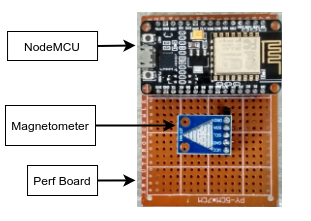
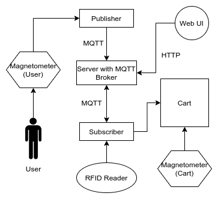

# Smart Cart: A human following IoT-based cart for interactive and economical shopping

In today’s era, people look for ways to minimize effort in quotidian tasks like shopping. Shopping carts are meant to aid the customers to carry huge loads. However, with some modifications, we can revolutionize the way we use them. We propose a human following smart shopping cart to provide a hassle-free, cost-effective shopping experience for the users in supermarkets and marts. Many attempts have been made to fulfil this task, but what these methods lacked was the freedom of movement of the cart to move in any direction according to the user. Our approach aims to grant this freedom to the cart by making sure that it follows the shopper even if he/she is not walking in a straight line. As an adjunct to this, a web user interface for keeping a track of the products in the cart will enhance the shopping experience for the users.

- Demo: [Drive link](https://drive.google.com/file/d/1CzWQMwOfYlxUJJP-2bT9CWxc67maiDHj/view?usp=sharing)
- Publication: [IEEE Xplore](https://ieeexplore.ieee.org/document/9214217)

